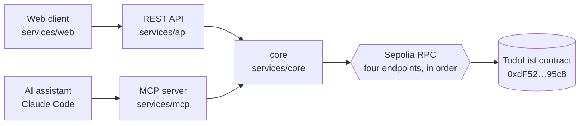
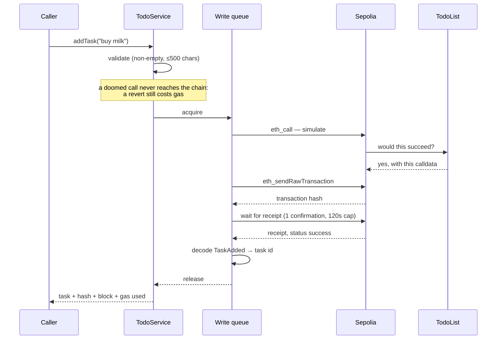

# Architecture

How the system is put together, and why.

## The shape

Three services run independently, each with its own port and start script, and
share one library holding every piece of blockchain knowledge in the system.

`core` is a library rather than a fourth service because what needed sharing was
the logic, not a process: imported at compile time, it makes it impossible for
the REST and MCP layers to disagree about how a transaction is sent, what counts
as success, or what an error means. The rule this imposes is that `api` and
`mcp` only translate their own protocol into `core` calls and `core` errors into
their own vocabulary — contract knowledge, transaction handling and retry logic
all belong in `core`.

## The contract

`TodoList`, deployed to Sepolia at
[`0xdF52AD4b53a094B97cA4a056d7f51b82E3b795c8`](https://sepolia.etherscan.io/address/0xdF52AD4b53a094B97cA4a056d7f51b82E3b795c8),
verified, solc 0.8.34:

| Function                | Kind  | Reverts with                                       |
| ----------------------- | ----- | -------------------------------------------------- |
| `getTasks()`            | view  | —                                                  |
| `addTask(string)`       | write | `Description cannot be empty`                      |
| `completeTask(uint256)` | write | `Task does not exist`, `Task is already completed` |

Two of its properties drive everything above it.

**The list is global and permissionless** — no owner, no `msg.sender` check.
Every caller shares one list and anyone may complete anyone's task, so the
authorization layer here is not a convenience; it is the only access control
that exists. It is also why `TASK_ALREADY_COMPLETED` is an ordinary outcome
rather than a rare race.

**Ids are sequential from zero**, assigned by the contract, so the id of a new
task is knowable only after the fact. It is decoded from the `TaskAdded` event
in the receipt rather than guessed from the list length, which would be wrong
the moment two writers overlap.

## The lifecycle of a write

Four rules hold on every write, from either service:

1. **Validate, then simulate, then send.** A reverted transaction still costs
   gas, so anything knowably doomed is refused before it can spend anything and
   `simulateContract` catches the rest, including races the caller could not
   have known about.
2. **A hash is not a result.** The call returns only after a receipt with
   `status: 'success'`.
3. **Never lose a hash.** If the receipt does not arrive inside the timeout the
   transaction may still be mined, so `TransactionTimeoutError` carries the hash
   and the transports surface it — HTTP `202`, a sticky notice in the UI.
4. **The id comes from the event**, so it is the id the chain assigned.

## Concurrency and nonces

Every transaction from one wallet carries a sequential nonce, and two built at
the same time collide: the network keeps one and drops the other. With one
shared signing wallet and two services that write, that is the default outcome
of concurrent use, not a corner case. Two overlapping defences:

- **A mutex around the whole simulate → send → wait block** (`async-mutex`, in
  `TodoService`), so the second write simulates against the state the first
  produced — which is also what makes "already completed" correct rather than
  racy.
- **viem's `nonceManager`**, deriving nonces from the chain for concurrent
  sends.

Verified: three concurrent adds through the REST API took nonces 31, 32 and 33
and produced tasks 17, 18 and 19 — no collision, no dropped transaction.

The mutex is per process, so it serializes writes within a service but not
between `api` and `mcp`, which share the wallet; between them only
`nonceManager` applies.

## Talking to the network

Reads and writes share a viem `fallback` transport over four public Sepolia
endpoints, tried in order, each with a 10-second timeout and two retries before
moving on. Public endpoints rate-limit and go down, and treating any one as
reliable would make the service flaky for reasons unrelated to this code.

## Errors

`core` throws typed errors from `core/src/errors.ts`, and nothing else in the
system ever sees a viem error: `mapChainError` walks the cause chain for
`ContractFunctionRevertedError`, matches the contract's revert strings, and
produces a typed error worded for a person. Each transport maps that one
taxonomy into its own vocabulary:

| `core` error                | REST              | MCP                                     |
| --------------------------- | ----------------- | --------------------------------------- |
| `ValidationError`           | 400               | `isError` result naming the field       |
| `TaskNotFoundError`         | 404               | `isError` result                        |
| `TaskAlreadyCompletedError` | 409               | `isError` result                        |
| `TransactionRevertedError`  | 422               | `isError` result with the revert reason |
| `TransactionTimeoutError`   | 202 + hash        | text result carrying the hash           |
| `ChainUnavailableError`     | 503 + Retry-After | `isError` result                        |
| `UnexpectedChainError`      | 502               | `isError` result                        |

A revert is `422` rather than `500` — the request was well-formed and the
service did its job; the contract declined. A timeout is `202`, not an error.

## Authentication

The MCP server accepts an OAuth 2.1 access token or a scoped API key, and both
become an identity in one function, `CredentialVerifier.verifyAccessToken`.
Everything above it deals in scopes and never in credentials, which is what
makes an external identity provider a contained change.
[MCP.md](MCP.md#roles-and-scopes) has the model in full.

**The REST API has no authentication.** It is the web client's backend and is
expected to sit behind whatever sign-in the surrounding deployment already has;
what guards it here is a single permitted browser origin and a cap of ten writes
a minute, so a misconfigured page cannot drain the wallet.

## Packaging

Each service has its own Dockerfile beside its source, and builds from a shared
one in `services/core`. That is the only sensible job for a Dockerfile in a
library that has no entrypoint: it installs the workspace and compiles every
package once, producing a file bundle the three runnable services copy out of,
so they cannot end up built from different code and the install does not happen
three times. Compose builds it first because the others name it as a build
context; it is declared with zero replicas, so it is never started.

Each service image then keeps only what it runs — production dependencies
from the lockfile, compiled output, no toolchain, no sources, non-root user —
and the web client is static files behind nginx. Compose publishes the same
ports the npm scripts use, so one set of URLs is correct either way, and the MCP
data directory is a named volume so credentials and the audit trail outlive a
rebuild.

## Testing

`core` is unit-tested against mocked viem clients, `api` and `mcp` against a
mocked core service. Nothing in the automated suite spends gas or touches the
network — it must run offline, on a machine with no funded wallet, for free.
Live verification is separate and deliberate: `npm run smoke` spends real
testnet gas and says so.

## Operating notes

- **The network is fixed in code.** The contract address is configuration, but
  `clients.ts` imports Sepolia directly and the chain id and explorer URLs
  derive from it, so another network is a code change.
- **The audit log is JSONL on disk**, which suits a single host.
- **Writes are not idempotent.** A retry after a network blip can produce a
  second transaction; the `202` path exists so a slow confirmation does not
  provoke one.
- **Every list read is a contract call**, which is fine at this volume and is
  where a cache would go if it stopped being so.
