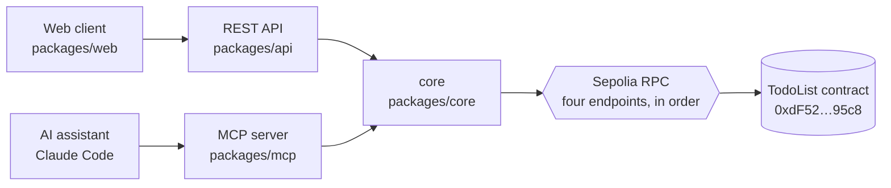
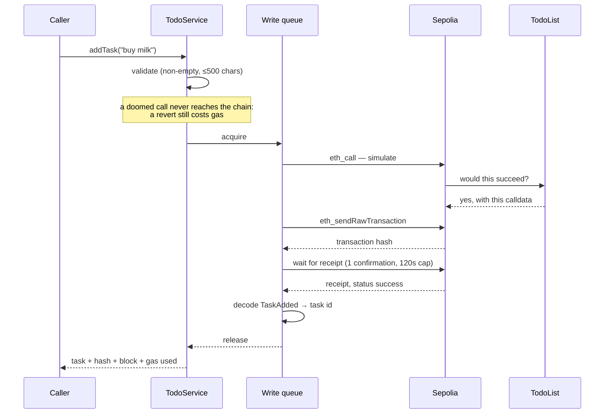
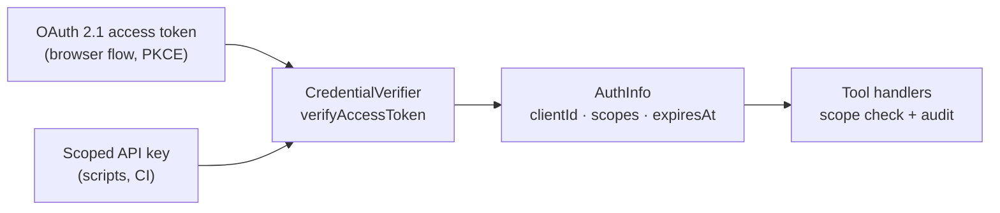

# Architecture

How the system is put together, and why it is put together that way.

## The shape

Three services run independently — each has its own port, its own start script,
its own `/health` — and share one library that owns every piece of blockchain
knowledge in the system.

## Why `core` is a library and not a fourth service

The obvious "more microservices" version of this puts a blockchain gateway
behind its own HTTP port. That would add a network hop, a serialization
boundary, and a new failure mode to every read, and would buy nothing: the two
callers are in the same trust domain, deploy together, and have no independent
scaling story.

What actually needed to be shared was the _logic_, not a _process_. As a
library, `core` is imported at compile time, which means the REST and MCP layers
cannot disagree about how a transaction is sent, what counts as success, or what
an error means — the compiler enforces it.

The tradeoff this makes is real and is discussed under
[concurrency](#concurrency-and-nonces): a per-process queue cannot coordinate
across processes.

**Rule this imposes.** `api` and `mcp` translate their own protocol into `core`
calls and `core` errors into their own vocabulary. Neither contains contract
knowledge, transaction handling, or retry logic. If a change would add any of
those to a transport, it belongs in `core`.

## What the contract is

`TodoList`, deployed to Sepolia at
[`0xdF52AD4b53a094B97cA4a056d7f51b82E3b795c8`](https://sepolia.etherscan.io/address/0xdF52AD4b53a094B97cA4a056d7f51b82E3b795c8),
verified, compiled with solc 0.8.34. Three functions:

| Function                | Kind  | Reverts with                                       |
| ----------------------- | ----- | -------------------------------------------------- |
| `getTasks()`            | view  | —                                                  |
| `addTask(string)`       | write | `Description cannot be empty`                      |
| `completeTask(uint256)` | write | `Task does not exist`, `Task is already completed` |

Two properties of it drive the design of everything above:

**The list is global and permissionless.** There is no owner and no
`msg.sender` check. Every caller shares one list and anyone may complete
anyone's task. The chain enforces nothing about who may do what, so our
authorization layer is not a convenience — it is the only access control that
exists. It is also why the web client says the list is shared, and why
`TASK_ALREADY_COMPLETED` is a real, ordinary outcome rather than a rare race.

**Ids are sequential from zero**, assigned by the contract. A client cannot
choose one, and the id of a new task is only knowable after the fact — which is
why the id is decoded from the `TaskAdded` event in the receipt rather than
guessed from the list length. Guessing would be wrong the moment two writers
overlap.

## The lifecycle of a write

Every write, from either service, goes through exactly this:

Four rules are enforced here, and they are the ones worth defending:

1. **Validate, then simulate, then send.** A reverted transaction still costs
   gas. Anything knowably doomed is refused before it can spend anything, and
   `simulateContract` catches the rest — including races the client could not
   have known about.
2. **A hash is not a result.** The call returns only after a receipt with
   `status: 'success'`. Reporting a submitted transaction as done would be a lie
   often enough to matter.
3. **Never lose a hash.** If the receipt does not arrive inside the timeout, the
   transaction is still on the network and may yet be mined. That is not an
   error: `core` throws `TransactionTimeoutError` carrying the hash, and the
   transports surface it (HTTP `202`, a sticky notice in the UI) so the caller
   can still track it.
4. **The id comes from the event.** `parseEventLogs` reads `TaskAdded` out of
   the receipt, so the id reported is the one the chain assigned.

## Concurrency and nonces

Every transaction from one wallet carries a sequential nonce. Two transactions
built at the same time get the same nonce, and the network keeps one and drops
the other. With a single shared signing wallet and two services that both write,
this is not a corner case — it is the default outcome of any concurrent use.

Two defences, deliberately overlapping:

- **A mutex around the whole simulate → send → wait block** (`async-mutex`, in
  `TodoService`). Simulation of the second write then happens against the state
  the first one produced, which is also what makes "already completed" correct
  rather than racy.
- **viem's `nonceManager` on the account**, which derives nonces from the chain
  and hands out sequential ones for concurrent sends.

Verified: three concurrent adds through the REST API produced nonces 31→34 and
tasks 17, 18 and 19 — no collision, no dropped transaction.

**The honest limit.** The mutex is per process. `api` and `mcp` are separate
processes sharing one wallet, so the mutex does not serialize _between_ them;
only `nonceManager` does, and it is best-effort. In production the answer is one
component that owns the key — a broadcaster service, or a signing service of the
Fireblocks kind — so that "who may send the next transaction" has exactly one
answer. This project documents the limit rather than pretending the mutex closes
it.

## Talking to the network

Reads and writes share a viem `fallback` transport over four public Sepolia
endpoints, tried in order, each with a 10-second timeout and two retries before
moving on. Public endpoints rate-limit and go down; treating any one of them as
reliable would make the service flaky for reasons that have nothing to do with
this code.

## Errors

`core` throws typed errors (`core/src/errors.ts`). Nothing else in the system
sees a viem error: `mapChainError` walks the cause chain for
`ContractFunctionRevertedError`, matches the contract's revert strings, and
produces a typed error with a message written for a person.

Each transport then maps that one taxonomy into its own vocabulary:

| `core` error                | REST              | MCP                                     |
| --------------------------- | ----------------- | --------------------------------------- |
| `ValidationError`           | 400               | `isError` result naming the field       |
| `TaskNotFoundError`         | 404               | `isError` result                        |
| `TaskAlreadyCompletedError` | 409               | `isError` result                        |
| `TransactionRevertedError`  | 422               | `isError` result with the revert reason |
| `TransactionTimeoutError`   | 202 + hash        | text result carrying the hash           |
| `ChainUnavailableError`     | 503 + Retry-After | `isError` result                        |
| `UnexpectedChainError`      | 502               | `isError` result                        |

A revert is `422`, not `500`: the request was well-formed and the service did
its job — the contract declined. A timeout is `202`, not an error at all.

## Authentication

Two ways in, one place where a credential becomes an identity:

Everything above the verifier deals in scopes and never in credentials, which is
what makes replacing the whole left-hand side with a real identity provider a
contained change. [MCP.md](MCP.md) covers the model in detail.

## Packaging

Each service ships as its own image, built from one Dockerfile with three
targets rather than three near-identical Dockerfiles. In a workspace monorepo
the install and compile steps are the same for every service, so sharing them
keeps one layer cache warm and removes the drift that three copies eventually
develop. What each target then keeps is only its own service: production
dependencies resolved from the lockfile, the compiled output, no toolchain and
no sources, running as a non-root user. The web client is static files behind
nginx, since nothing about it needs a Node process at runtime.

Compose publishes the same ports the npm scripts use, which is what keeps one
set of URLs correct in both worlds. The MCP data directory is the only state in
the system and is a named volume, so credentials and the audit trail outlive a
rebuild.

## Testing

`core` is unit-tested against mocked viem clients; `api` and `mcp` against a
mocked core service. Nothing in the automated suite spends gas or touches the
network — the suite must be runnable offline, on a machine with no funded
wallet, without cost. Live verification is deliberate and separate:
`npm run smoke` spends real testnet gas and says so.

## What would change with more time

- **A transaction broadcaster.** One component owning the key and a durable
  queue, with the services enqueueing intents rather than sending. That fixes
  the cross-process nonce gap properly, survives a restart mid-flight, and gives
  retries somewhere sensible to live.
- **A durable audit store.** The audit log is JSONL on disk: fine for one
  machine, useless across replicas. Anything real wants an append-only store
  that outlives the container.
- **A real identity provider.** The OAuth server here is genuine and complete
  for a single service. A second service would want Auth0, Keycloak or similar
  behind the same verifier seam.
- **Idempotency keys on writes.** A client that retries after a network blip
  currently risks a second transaction. An idempotency key on `POST /tasks`
  would let the service recognise the retry and return the first result.
- **Reads from an indexed view.** Every list read is a contract call. At any
  real volume that becomes an indexer and a cache, with the chain as the source
  of truth behind it.
