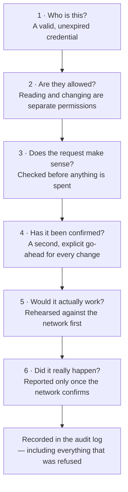
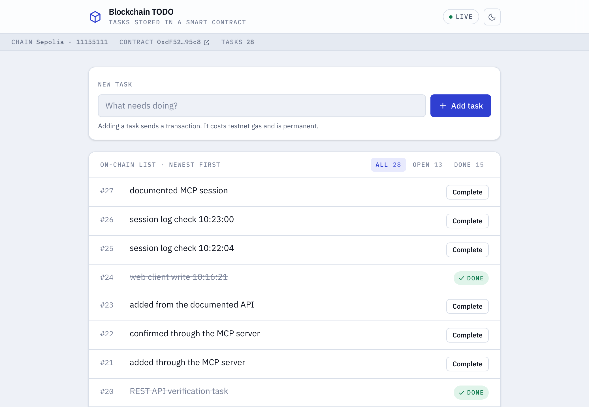
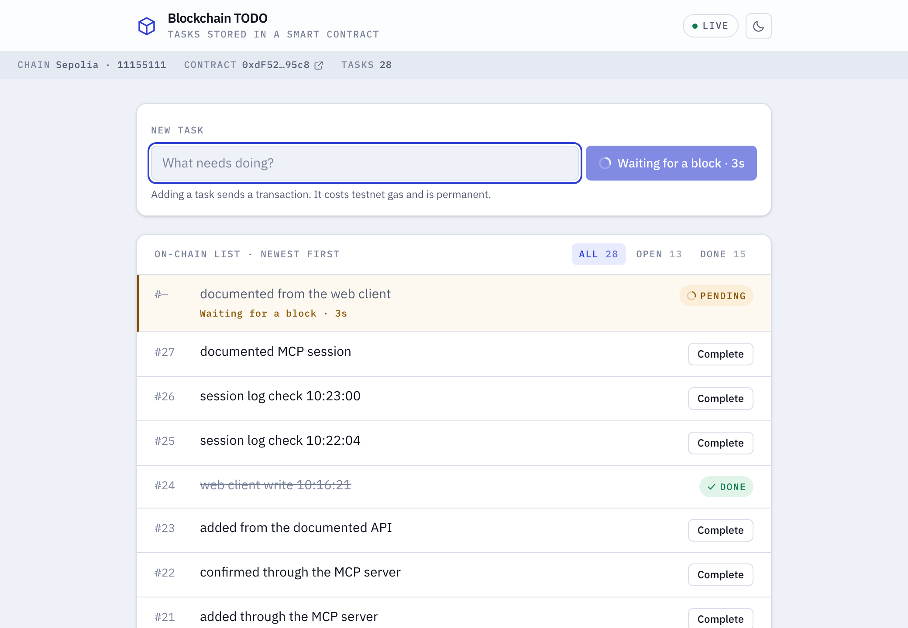
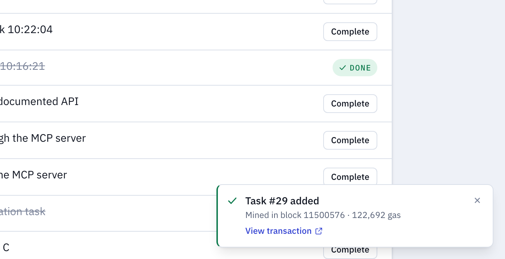
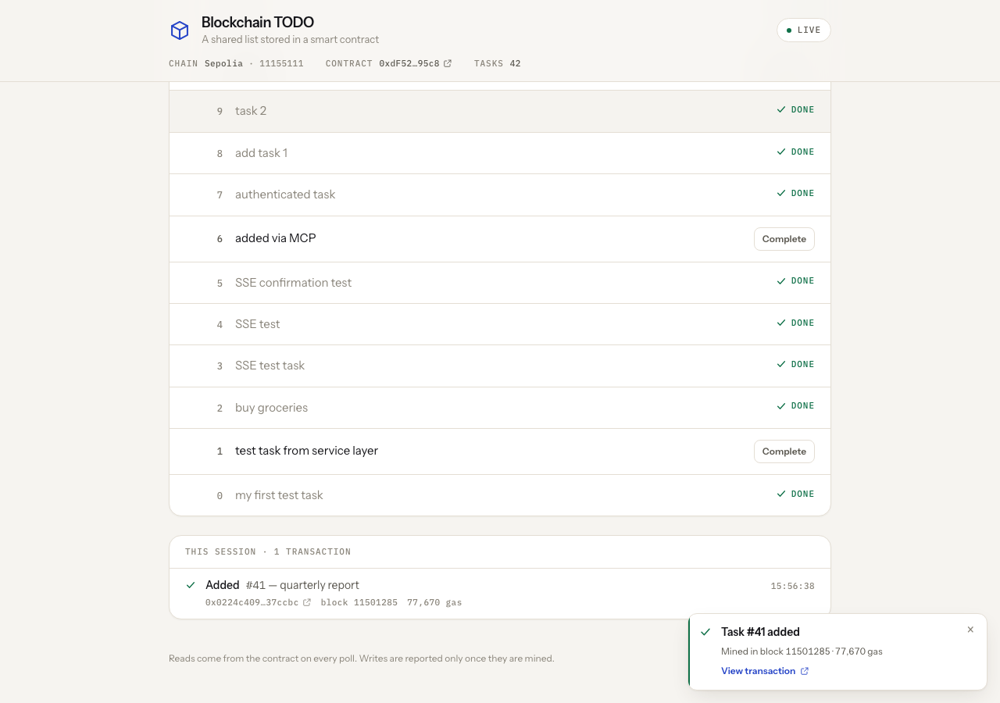

# What this is, without the jargon

A shared to-do list that lives on a blockchain, and three ways to use it: a web
page, a programming interface, and an AI assistant you can talk to. No
blockchain knowledge needed to read this.

## The list

Most apps keep their data in a database that one company owns. This list is kept
in a **smart contract** instead: a small program that lives on a public network
and holds its own data. Anyone can read it, anyone can add to it, and nobody can
quietly rewrite what is already there.

Two consequences run through every decision here. **Changes cost money and take
time** — adding a task means asking a worldwide network to agree on it, about
fifteen seconds and a small fee, paid here in test money so nothing real is
spent. And **changes cannot be undone**: no delete, no edit, no restoring from
backup. That is the property that makes the record trustworthy, and it is why so
much of the design is about being sure _before_ acting.

## Talking to it

The MCP server is what lets an assistant use the list. MCP is a standard way to
hand an AI assistant a set of tools — buttons it is allowed to press, described
precisely enough that it knows what each does and what it costs. So instead of
opening a page and filling in a form:

> "What's on the list? Add one for renewing the insurance, and mark the invoice
> one as done."

The value is not the saved typing. It is that the assistant can be given exactly
as much power as you want it to have and no more, and that everything it does is
recorded.

## What stops it going wrong

Six checks stand between "the assistant decided to do something" and "money was
spent".

**Who is this?** Every request carries a credential the server checks itself.
Credentials expire, can be revoked instantly, and are stored scrambled, so even
someone reading our files cannot use them.

**Are they allowed?** Reading and changing are separate permissions: a _viewer_
credential can look and nothing more, an _operator_ can make changes, and a
refusal names exactly what was missing rather than failing vaguely or silently.
This matters more than usual, because the contract itself has no notion of
permissions — anyone in the world with its address can write to it. This layer
is not one safety net among several. It is the only one.

**Does the request make sense?** An empty task, or one for an item that does not
exist, is refused before anything is spent — a doomed request still costs a fee
if you let it reach the network.

**Has it been confirmed?** Nothing happens on a first request. The server
replies describing what would be done, and only a second, explicitly confirming
request goes ahead; where the assistant's software supports it, that
confirmation is a prompt shown to you, and a cancel sends nothing. The guarantee
is that no change happens without a deliberate second step and that every
unconfirmed attempt is recorded — not that a human took that step, since an
assistant can confirm its own request. Where that distinction matters, give the
assistant a viewer credential and keep spending somewhere a person controls.

**Would it actually work?** The change is rehearsed against the network first.
If the rehearsal fails, nothing is sent.

**Did it really happen?** The one people get wrong. Sending something to a
blockchain immediately returns a receipt number, and it is tempting to call that
success — but the network can still reject it. Success is reported only once the
network confirms, and if confirmation is slow you are told exactly that and
handed the tracking number rather than a guess.

**And it is all written down.** Every attempt — successful, refused or abandoned
— is recorded with who, what, when, how long it took and the resulting
transaction. The credential itself is never recorded, only which one it was.

Those six guard the assistant's route in. The web page talks to the programming
interface, which has no credentials of its own by design: it is an internal
service expected to sit behind whatever sign-in the surrounding system already
has, so it should not be exposed to the internet as it stands.

## Seeing it work

The web page shows the same list, and the bar under the title always says which
contract is on screen and whether the service is answering.

A change in progress is marked as not yet real, with a count of how long it has
been waiting:

On confirmation you are told what it cost, with a link to the public record:

Every change made in a session stays listed, so "what did I actually send?"
always has an answer:

## Three things to know

- **It runs on a practice network.** Sepolia behaves like the real Ethereum
  network, but its money has no value.
- **The list is shared and public.** This contract holds one global list with no
  owner, so everyone using it sees the same tasks and can complete any of them.
- **One wallet signs everything**, which is why who may use that key is the
  question the permissions above exist to answer.

## Where to go next

- [SETUP.md](SETUP.md) — running it yourself
- [MCP.md](MCP.md) — the assistant-facing side in detail
- [ARCHITECTURE.md](ARCHITECTURE.md) — how it is built and why
