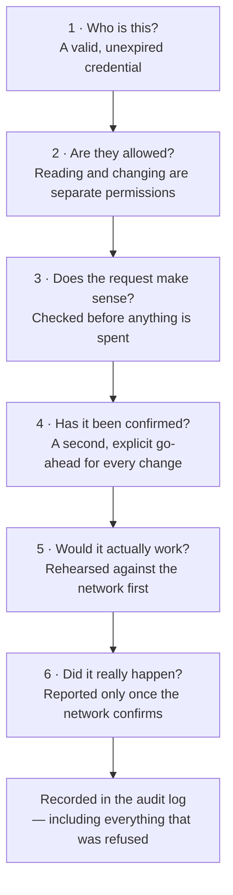

# What this is, without the jargon

A shared to-do list that lives on a blockchain, and three ways to use it: a web
page, a programming interface, and an AI assistant you can talk to.

No blockchain knowledge needed to read this.

## The list

Most apps keep their data in a database that one company owns. This list is kept
in a **smart contract** instead: a small program that lives on a public network
and holds its own data. Anyone can read it. Anyone can add to it. Nobody can
quietly rewrite what is already there.

Two consequences run through every decision in this project:

**Changes cost money and take time.** Adding a task means asking a worldwide
network to agree on it. That takes about fifteen seconds, and there is a small
fee — here paid in test money on a practice network, so nothing real is spent.

**Changes cannot be undone.** There is no delete, no edit, no "restore from
backup". A task added by mistake is added forever. That is not a limitation we
worked around; it is the property that makes the record trustworthy, and it is
why so much of the design is about being sure _before_ acting.

## Talking to it

The novel piece is the **MCP server**. MCP is a standard way to give an AI
assistant a set of tools it can use on your behalf — think of it as a set of
buttons the assistant is allowed to press, described precisely enough that it
knows what each one does and what it costs.

Instead of opening a page and filling in a form, you say:

> "What's on the list? Add one for renewing the insurance, and mark the invoice
> one as done."

The assistant reads the list, adds the task, and marks the other one complete —
each through a tool this project provides, and each subject to the safeguards
below.

The value is not that it saves typing. It is that the assistant can be given
_exactly_ as much power as you want it to have, and no more, and that everything
it does is recorded.

## What stops it going wrong

Six checks stand between "the assistant decided to do something" and "money was
spent on the blockchain". Every one of them can stop it.

These are the safeguards on the **assistant's** route in. The web page talks to
the programming interface, which deliberately has no credentials of its own: it
is an internal service, and the expectation is that it sits behind whatever
sign-in the surrounding system already has. Anyone who can reach it directly can
spend gas through it, limited only by a cap on how many changes a minute it will
accept. That is a reasonable arrangement for a service on a private network and
not one to expose to the internet as it stands.

**Who is this?** Every request carries a credential the server checks itself.
Credentials expire, can be revoked instantly, and are stored scrambled so that
even someone reading our files cannot use them.

**Are they allowed?** Reading and changing are separate permissions. A
_viewer_ credential can look at the list and nothing else; asking it to add a
task gets a clear refusal explaining exactly what is missing — never a vague
error, and never silence. An _operator_ credential can make changes.

This matters more than usual here. The contract itself has no notion of
permissions at all: anyone in the world with its address can write to it. Our
permission layer is not one of several safety nets. It is the only one.

**Does the request make sense?** An empty task, or one for an item that does
not exist, is refused before anything is spent. A doomed request still costs a
fee if you let it reach the network, so we do not let it.

**Has the change been confirmed?** No change happens on a first request. The
server refuses it and replies with a plain-language description of exactly what
would be done, and only a second, explicitly confirming request goes ahead.
Where the assistant's software supports it, that confirmation is a prompt shown
to you directly, and a cancel or a closed window means nothing is sent.

Worth being precise about the limit, because it is the difference between two
quite different promises: the server guarantees that nothing happens without a
deliberate second step, and it records every unconfirmed attempt. It cannot by
itself guarantee that a human, rather than the assistant, took that step — an
assistant is capable of confirming its own request. What keeps a person in the
loop is the approval prompt in the assistant's own software. If that matters in
your setting, use a viewer credential for the assistant and keep the ability to
spend somewhere a person controls.

**Would it actually work?** The change is rehearsed against the network first.
If the rehearsal fails, nothing is sent.

**Did it really happen?** This is the one people get wrong. When you send
something to a blockchain you immediately get a receipt number, and it is
tempting to call that success. It is not: the network can still reject it. This
system reports success only after the network has confirmed it, and if
confirmation is slow it says exactly that and hands you the tracking number
rather than guessing.

**And it is all written down.** Every attempt — successful, refused, or
abandoned — is recorded with who, what, when, how long it took, and the
resulting transaction. The credential itself is never recorded, only which one
it was.

## Seeing it work

The web page shows the same list.

The bar under the title always says which contract is being shown and whether
the service is answering. Nothing is hidden about where the data comes from.

While a change is going through, it is clearly marked as not yet real, with a
count of how long it has been waiting:

And when the network confirms, you are told what it cost and given a link to the
public record of it:

Every change made in a session stays listed, so you can always answer "what did
I actually send?":

## Limitations

- **It is on a practice network.** Sepolia behaves like the real Ethereum
  network but its money has no value. Moving to the real one is a small code
  change — the network is currently fixed rather than configurable — and a much
  larger governance question about who is allowed to hold a key that spends
  real money.
- **The list is shared and public.** This particular contract has one global
  list with no owner, so anyone using it sees everyone's tasks and can complete
  any of them. Fine for a demonstration; a real deployment would want a contract
  with a notion of ownership.
- **One key signs everything.** All changes are made by a single wallet held by
  the service. In production that key belongs in a dedicated signing service
  rather than in an application's environment.

## Where to go next

- [SETUP.md](SETUP.md) — running it yourself
- [MCP.md](MCP.md) — the assistant-facing side in detail
- [ARCHITECTURE.md](ARCHITECTURE.md) — how it is built and why
