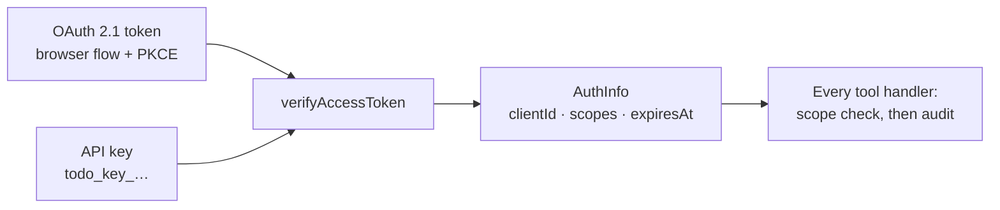
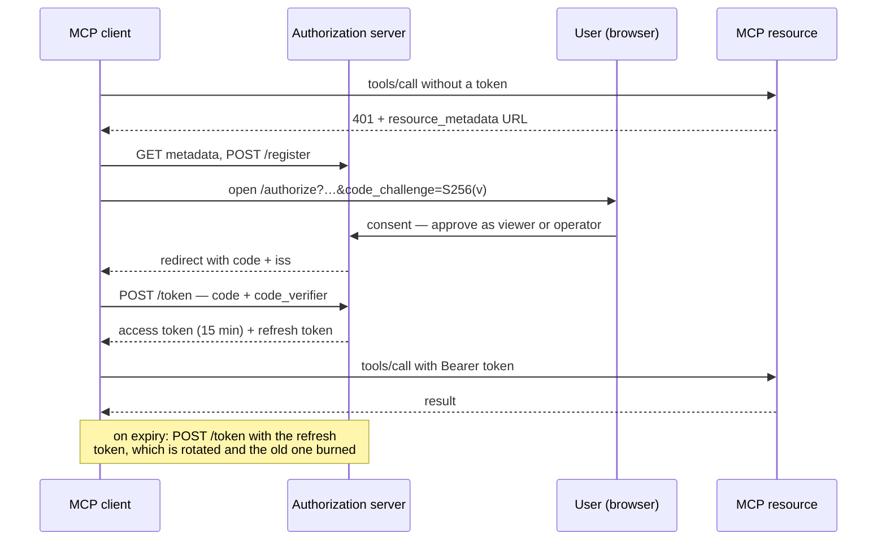

# MCP server

An MCP server that lets an AI assistant read and change the on-chain to-do list
by talking, with authentication and access control that the chain itself does
not provide.

- **Endpoint** `http://localhost:3001/mcp`
- **Transport** Streamable HTTP
- **Auth** OAuth 2.1 (browser flow) or a scoped API key — both `Bearer`

Setup instructions are in [SETUP.md](SETUP.md). This document is the model: what
the tools are, who may call them, and why it is built this way.

## Why Streamable HTTP and not stdio

stdio has no authentication story. A stdio server inherits whatever the process
that spawned it can do, and any credential lives in the environment of that
process. Over HTTP every single call carries a credential this server verifies
itself, which is what makes "this caller may read but not write" a statement the
server can enforce rather than a convention.

## The tools

| Tool           | Scope required | Effect                                            |
| -------------- | -------------- | ------------------------------------------------- |
| `getTasks`     | `tasks:read`   | Reads the list. Free, changes nothing             |
| `addTask`      | `tasks:write`  | Sends a transaction. Spends gas, cannot be undone |
| `completeTask` | `tasks:write`  | Sends a transaction. Spends gas, cannot be undone |

Inputs are zod schemas, so the client gets a typed contract rather than prose.
Descriptions state the cost and the irreversibility, because a model choosing
between tools reads the description and nothing else. Both writes also accept
`confirm: boolean` — see [confirmation](#confirmation-before-a-write).

## A real session

Everything below is actual wire traffic against a running server, captured in
one sitting.

### No credential

```text
HTTP 401
www-authenticate: Bearer error="invalid_token",
  error_description="Missing Authorization header",
  resource_metadata="http://localhost:3001/.well-known/oauth-protected-resource"

{ "error": "invalid_token", "error_description": "Missing Authorization header" }
```

The challenge names the metadata document, which is what lets a client that was
handed nothing but a URL discover how to authenticate and start the flow itself.

### The metadata it points at (RFC 9728)

```json
{
  "resource": "http://localhost:3001/",
  "authorization_servers": ["http://localhost:3001/"],
  "scopes_supported": ["tasks:read", "tasks:write", "tasks:admin"],
  "resource_name": "Blockchain TODO list"
}
```

### A read-only credential lists the tools

```json
[
  {
    "name": "getTasks",
    "description": "Read every task on the shared to-do list… costs nothing and changes nothing."
  },
  {
    "name": "addTask",
    "description": "Add a task… spends gas, takes around fifteen seconds to confirm, and cannot be undone. Your current credential is read-only, so this call will be refused; an operator credential is required."
  },
  {
    "name": "completeTask",
    "description": "Mark a task as completed… Your current credential is read-only, so this call will be refused; an operator credential is required."
  }
]
```

### It reads

```text
27 tasks on-chain:
[x] #0 my first test task
[ ] #1 test task from service layer
[x] #2 buy groceries
…
```

### It is refused a write

```json
{
  "content": [
    {
      "type": "text",
      "text": "insufficient_scope: this operation requires \"tasks:write\" but your credential grants tasks:read. Ask for an operator credential to make changes."
    }
  ],
  "isError": true
}
```

### An operator write, before confirming

```json
{
  "content": [
    {
      "type": "text",
      "text": "Confirmation required before this runs.\n\nAdd the task \"documented MCP session\".\n\nThis sends a blockchain transaction: it spends testnet funds, takes around fifteen seconds, and cannot be undone. To go ahead, call this tool again with the same arguments plus \"confirm\": true."
    }
  ],
  "isError": true
}
```

### And after

```text
Added task #27: "documented MCP session".
Confirmed in block 11500562, 77742 gas.
https://sepolia.etherscan.io/tx/0x241d229bf01957b23bf13d753067e7f2e0bac42b814e692f1893d60c031ae1ad
```

13.8 seconds, one transaction, one receipt.

## Access control

### Two ways in, one place they converge



`CredentialVerifier.verifyAccessToken` is the only function in the server that
turns a credential into an identity. Everything above it deals in scopes. That
is what makes swapping in a real identity provider a contained change, and it is
why both mechanisms behave identically once you are past the door.

### Roles are bundles of scopes

| Role       | Scopes                                     | For                              |
| ---------- | ------------------------------------------ | -------------------------------- |
| `viewer`   | `tasks:read`                               | Anything that only needs to look |
| `operator` | `tasks:read`, `tasks:write`                | Assistants that act              |
| `admin`    | `tasks:read`, `tasks:write`, `tasks:admin` | Managing credentials             |

Every authorization decision in the server is a scope check. Roles exist only as
named bundles, so adding a role never means touching a tool.

### Every caller sees every tool

The first version hid write tools from read-only callers, which is a common
pattern. It was wrong here. A model that cannot see `addTask` reports "the tool
does not exist" — the user reads that as a broken server, and the real cause,
an under-privileged credential, is invisible to everyone.

So all three tools are always registered, the handler enforces the scope, and
the refusal names the scope that was missing. Read-only callers additionally get
a sentence in the tool description saying the call will be refused, so a model
can avoid spending a turn discovering it.

The rule this follows: **a refusal must be distinguishable from an absence.**

### Confirmation before a write

Both writes require explicit approval before anything reaches the chain:

1. If the client supports **elicitation**, the server asks and waits.
2. If it does not, the first call returns the confirmation text above, and the
   client must repeat the call with `confirm: true`.

Anything that is not an explicit accept — a decline, a cancel, a timeout, a
missing flag — means nothing is sent. The audit entry records the attempt with
`reason: "awaiting confirmation"`, so a refusal to confirm is visible too.

### Every call is audited

One JSONL line per call, written whatever the outcome, to `data/audit.jsonl`:

```json
{"timestamp":"2026-08-16T10:26:48.898Z","clientId":"9b6e1411","credential":"api-key",
 "role":"viewer","tool":"addTask","arguments":{"description":"should never reach the chain"},
 "scopes":["tasks:read"],"outcome":"denied","durationMs":1,
 "reason":"insufficient_scope: this operation requires \"tasks:write\"…"}

{"timestamp":"2026-08-16T10:27:02.688Z","clientId":"7ec1b28c","credential":"api-key",
 "role":"operator","tool":"addTask","arguments":{"description":"documented MCP session","confirm":true},
 "scopes":["tasks:read","tasks:write"],"outcome":"success","durationMs":13781,
 "transactionHash":"0x241d229bf0…"}
```

Identity is the credential **id**, never the credential. Nothing that could be
replayed is ever written to the log.

## OAuth 2.1

The server is both the resource server and, for this project, a small
authorization server. It implements authorization code with PKCE, dynamic client
registration, and refresh-token rotation.



| Endpoint                                  | Purpose                             |
| ----------------------------------------- | ----------------------------------- |
| `/.well-known/oauth-protected-resource`   | RFC 9728 — what this resource is    |
| `/.well-known/oauth-authorization-server` | RFC 8414 — where to get a token     |
| `/register`                               | Dynamic client registration         |
| `/authorize`                              | Consent page; a role is chosen here |
| `/token`                                  | Code exchange and refresh           |
| `/revoke`                                 | Token revocation                    |

What the implementation is careful about:

- **PKCE is required.** `code_challenge_methods_supported` is `["S256"]` only.
  The code alone is useless to an interceptor without the verifier.
- **Refresh tokens rotate.** Each use issues a new one and burns the old. A
  replayed refresh token fails, which is how you notice it was stolen.
- **Access tokens are short.** 15 minutes by default. A leaked one stops working
  on its own.
- **`iss` is returned** on the authorization response (RFC 9207), so a client
  cannot be tricked about which server answered.
- **The redirect URI is re-checked at consent**, against what the client
  registered — not against what the consent form submitted. The form is a
  hostile input like any other, and it is also signed, so it cannot be forged.
- **Audience is validated.** A token minted for another resource is not accepted
  here.

### What this authorization server does not do

Worth saying plainly, because the gap is deliberate rather than overlooked:

- **It authenticates nobody.** There is no login. Whoever reaches the consent
  page can approve a client and pick a role for it, so the security boundary is
  "can you reach this page", not "who are you". That is honest for a service on
  localhost and wrong for anything else — and it is the specific job a real
  identity provider does. The verifier seam is where one plugs in.
- **Consent state and access tokens live in memory.** A restart invalidates
  in-flight authorization requests and forces clients to refresh, which is the
  right outcome for a sixty-second flow and a fifteen-minute token. Refresh
  tokens, which must survive a restart, are hashed on disk.
- **Credentials are a single JSON file.** Fine for one process on one host;
  several instances behind a load balancer would need shared storage.

Rate limits do apply to the unauthenticated surface. The SDK limits its own
endpoints — registration to 20 an hour, token and revocation to 50 per fifteen
minutes, authorization to 100 — and the consent submission, which is ours and
is what actually mints a code, is limited to 30 a minute. Registered clients
are capped at 200, oldest evicted, because registration needs no credential and
appends to that file every time.

## Why keep API keys as well

Because a browser flow is the wrong shape for some callers, and pretending
otherwise pushes people into worse workarounds:

|                     | OAuth 2.1                                | API keys                                  |
| ------------------- | ---------------------------------------- | ----------------------------------------- |
| Best for            | Interactive clients with a human present | Scripts, CI, non-interactive clients      |
| Credential lifetime | 15 minutes, refreshed                    | Days, with an explicit expiry             |
| Consent             | A person approves and picks a role       | Granted when issued                       |
| Setup               | Automatic from a 401                     | One CLI command                           |
| Revocation          | Revoke the token or the client           | `keys revoke <id>`, effective immediately |

Both are hashed at rest, both carry scopes and an expiry, both resolve to the
same `AuthInfo`, and both are audited identically. The choice is about the
caller, not about how much security you want.

The keys are stored as SHA-256 hashes — a key is high-entropy and randomly
generated, so a slow KDF buys nothing against a password guessing attack that
cannot happen. Comparison is constant-time. A key is shown once, at issue.

## Multi-tenancy

Not built, and the reason is worth stating: this contract has one global list,
so there is nothing to partition. The pieces that would be needed are already in
the right places — a client identity per tenant, scopes carried through the same
verifier, and audit entries already keyed by client. What would change is that
`TodoService` would take a contract address per tenant instead of one from
configuration, and the verifier would resolve a tenant alongside the scopes.

## The "go further" items

| Item                             | Status                                                                                  |
| -------------------------------- | --------------------------------------------------------------------------------------- |
| Multiple permission tiers        | Done — viewer / operator / admin as scope bundles                                       |
| Confirmation step before writes  | Done — elicitation, with a `confirm: true` fallback                                     |
| Logging and observability        | Done — JSONL audit of every call, structured logs                                       |
| Token expiry and rotation        | Done — 15-minute access tokens, rotating refresh tokens, per-key expiry, revocation CLI |
| Standards-based auth (OAuth 2.1) | Done — code + PKCE, RFC 9728 metadata, RFC 9207 `iss`, audience validation              |
| Multi-tenancy                    | Documented above, deliberately not built                                                |
