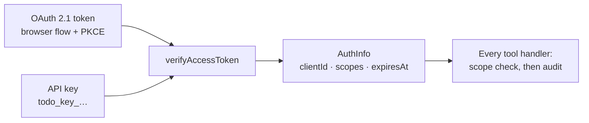
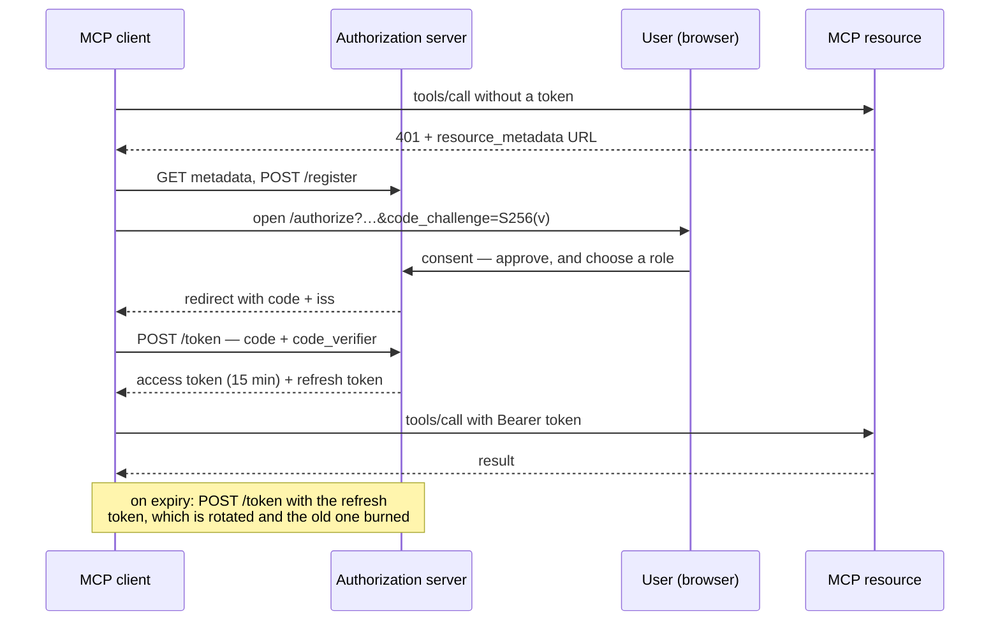

# MCP server

Lets an AI assistant read and change the on-chain to-do list conversationally,
with the authentication and access control the chain itself does not provide.

- **Endpoint** `http://localhost:3001/mcp`
- **Transport** Streamable HTTP — every call carries a credential this server
  verifies, which is what makes "may read but not write" enforceable rather than
  a convention
- **Auth** OAuth 2.1 (browser flow) or a scoped API key, both as `Bearer`

To connect a client, see [SETUP.md](SETUP.md#connect-an-ai-assistant).

## The tools

| Tool           | Scope required | Effect                                            |
| -------------- | -------------- | ------------------------------------------------- |
| `getTasks`     | `tasks:read`   | Reads the list. Free, changes nothing             |
| `addTask`      | `tasks:write`  | Sends a transaction. Spends gas, cannot be undone |
| `completeTask` | `tasks:write`  | Sends a transaction. Spends gas, cannot be undone |

Inputs are zod schemas, so a client gets a typed contract rather than prose.
Each description states the cost and the irreversibility, because a model
choosing between tools reads the description and nothing else. Both writes also
take `confirm: boolean` — see [confirmation](#confirmation-before-a-write).

## Roles and scopes

| Role       | Scopes                      | For                              |
| ---------- | --------------------------- | -------------------------------- |
| `viewer`   | `tasks:read`                | Anything that only needs to look |
| `operator` | `tasks:read`, `tasks:write` | Assistants that act              |

Every authorization decision is a scope check; roles are only named bundles, so
adding one never means touching a tool. There are two because there are two
things a caller can do here — read the list, or spend money changing it.
Credential management is not a third, since it happens through a local CLI
rather than over HTTP.

Both credential types converge on one function,
`CredentialVerifier.verifyAccessToken`, which turns a credential into an
`AuthInfo` of client id, scopes and expiry:



Everything above that function deals in scopes and never in credentials, which
is what makes swapping in an external identity provider a contained change.

### Every caller sees every tool

All three tools are registered for every caller, and the handler enforces the
scope. Hiding write tools from a read-only caller would make a model report "the
tool does not exist", which reads as a broken server and hides the real cause. A
refusal must be distinguishable from an absence, so the refusal names the scope
that was missing, and read-only callers get a sentence in the tool description
saying the call will be refused.

### Confirmation before a write

No write reaches the chain on a first request:

1. Where the client supports **elicitation**, the server asks and waits.
2. Otherwise the call returns a description of what would happen, and the client
   must repeat it with `confirm: true`.

Anything that is not an explicit accept — a decline, a cancel, a timeout, a
missing flag — sends nothing, and the attempt is audited with
`reason: "awaiting confirmation"`.

What this guarantees is that no write happens without a deliberate second step,
and that every unconfirmed attempt is recorded. It does not guarantee a human
took that step: `confirm` is an ordinary tool argument, so a model can set it on
the first call. Keeping a person in the loop is the client's own approval
prompt. Where that is not enough, give the assistant a viewer credential and
keep write access somewhere a person holds.

### Every call is audited

One JSONL line per call to `data/audit.jsonl`, whatever the outcome:

```json
{"timestamp":"2026-08-16T10:26:48.898Z","clientId":"9b6e1411","credential":"api-key",
 "role":"viewer","tool":"addTask","arguments":{"description":"should never reach the chain"},
 "scopes":["tasks:read"],"outcome":"denied","durationMs":1,
 "reason":"insufficient_scope: this operation requires \"tasks:write\"…"}

{"timestamp":"2026-08-16T10:27:02.688Z","clientId":"7ec1b28c","credential":"api-key",
 "role":"operator","tool":"addTask","arguments":{"description":"documented MCP session","confirm":true},
 "scopes":["tasks:read","tasks:write"],"outcome":"success","durationMs":13781,
 "transactionHash":"0x241d229bf0…"}
```

Identity is the credential **id**, never the credential — nothing replayable is
written to the log.

## A session, as it happens

Real traffic from a running server. **No credential** gets a `401` naming the
metadata document, which is what lets a client handed only a URL discover how to
authenticate:

```text
HTTP 401
www-authenticate: Bearer error="invalid_token",
  error_description="Missing Authorization header",
  resource_metadata="http://localhost:3001/.well-known/oauth-protected-resource"
```

**A read-only credential is refused a write**, and told exactly why:

```text
insufficient_scope: this operation requires "tasks:write" but your credential
grants tasks:read. Ask for an operator credential to make changes.
```

**An operator's first attempt is held**, then goes through on confirmation —
13.8 seconds end to end:

```text
Confirmation required before this runs.
Add the task "documented MCP session".
This sends a blockchain transaction: it spends testnet funds, takes around
fifteen seconds, and cannot be undone. To go ahead, call this tool again with
the same arguments plus "confirm": true.

→ Added task #27: "documented MCP session".
  Confirmed in block 11500562, 77742 gas.
  https://sepolia.etherscan.io/tx/0x241d229bf01957b23bf1…
```

## OAuth 2.1

The server is the resource server and also a small authorization server,
implementing authorization code with PKCE, dynamic client registration and
refresh-token rotation.



| Endpoint                                  | Purpose                                |
| ----------------------------------------- | -------------------------------------- |
| `/.well-known/oauth-protected-resource`   | RFC 9728 — what this resource is       |
| `/.well-known/oauth-authorization-server` | RFC 8414 — where to get a token        |
| `/register`                               | Dynamic client registration            |
| `/authorize`                              | Consent page; a role is chosen here    |
| `/oauth/consent`                          | The submitted decision; mints the code |
| `/token`                                  | Code exchange and refresh              |
| `/revoke`                                 | Token revocation                       |

All of those come from the MCP SDK except `/oauth/consent`, which is ours
because only this service knows what a role means — and being the request that
mints a code, it is the one we rate-limit ourselves.

What the flow enforces:

- **PKCE is mandatory** — `code_challenge_methods_supported` is `["S256"]` only,
  so an intercepted code is useless without the verifier.
- **Refresh tokens rotate.** Each use burns the old one; presenting a spent
  token ends the whole session, on the basis that a replay means it was copied.
- **Access tokens last 15 minutes**, so a leaked one stops working on its own.
- **`iss` is returned** (RFC 9207), identical to the advertised issuer, so a
  client cannot be misled about which server answered.
- **The redirect URI is re-checked at consent** against what the client
  registered, not against what the form submitted — and the form is signed, so
  it cannot be forged.
- **The audience is validated** (RFC 8707): a token minted for another resource
  is refused here.

Two operational notes. There is no login: whoever can reach the consent page can
approve a client, so the boundary is network reach, and an external identity
provider plugs in at the verifier. And credentials live in one JSON file, which
suits a single host; several instances would need shared storage.

Rate limits cover the unauthenticated surface — the SDK caps registration at 20
an hour, token and revocation at 50 per fifteen minutes and authorization at
100; the consent submission is capped at 30 a minute; and registered clients are
capped at 200, oldest evicted, since registration needs no credential.

## Why both OAuth and API keys

A browser flow is the wrong shape for a script or a CI job, and pretending
otherwise pushes people into sharing interactive credentials:

|                     | OAuth 2.1                                | API keys                                  |
| ------------------- | ---------------------------------------- | ----------------------------------------- |
| Best for            | Interactive clients with a human present | Scripts, CI, non-interactive clients      |
| Credential lifetime | 15 minutes, refreshed                    | Days, with an explicit expiry             |
| Consent             | A person approves and picks a role       | Granted when issued                       |
| Setup               | Automatic from a 401                     | One CLI command                           |
| Revocation          | Revoke the token or the client           | `keys revoke <id>`, effective immediately |

Both are hashed at rest, carry scopes and an expiry, resolve to the same
`AuthInfo`, and are audited identically — the choice is about the caller, not
about how much security you want. Keys are stored as SHA-256 hashes and compared
in constant time; a key is high-entropy and randomly generated, so a slow KDF
would buy nothing against a guessing attack that cannot happen. A key is shown
once, at issue.

## At a glance

One fact drives all of it: this server spends money that cannot be recovered, on
the instruction of something that is not a person. A single shared password
would keep the world out, but it could not tell you who spent what, hand someone
read-only access, or be revoked from one caller without disrupting the rest.

| Capability              | How it works                                                                                                                    |
| ----------------------- | ------------------------------------------------------------------------------------------------------------------------------- |
| Permission tiers        | Separate read and write scopes, bundled as viewer and operator roles                                                            |
| Approval before a write | Elicitation where supported, a `confirm: true` argument otherwise                                                               |
| Audit trail             | One JSONL line per call — successes, refusals and errors alike                                                                  |
| Credential lifetime     | 15-minute access tokens, refresh rotated on every use, per-key expiry, revocation effective on the next call                    |
| Standards-based auth    | OAuth 2.1 code + PKCE, RFC 9728 resource metadata, RFC 9207 `iss`, RFC 8707 audience validation                                 |
| Rate limiting           | SDK limits on its own OAuth endpoints, 30 a minute on the consent submission, 200 registered clients with oldest-first eviction |
